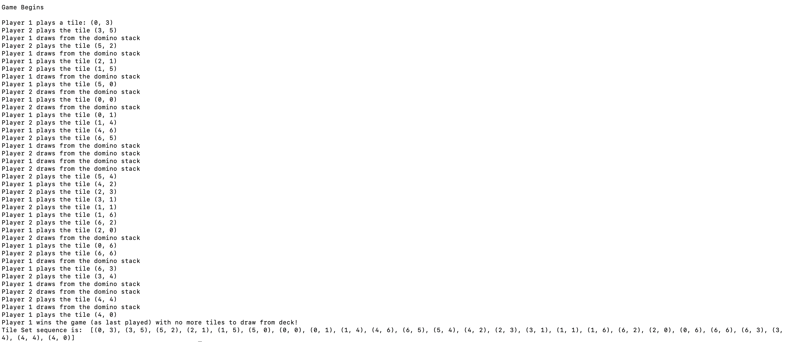

# dominoesGame

- This is simpele game called [dominoes](https://en.wikipedia.org/wiki/Dominoes).
- There are 28 tiles in the game. Each tile has two values on it: two numbers from 0 to 6. Each
tile is unique.
- Tiles can be connected by their ends, if the values on the touching halves are the same. A tile
can be also reversed to align it. A series of connected tiles form a domino line. In our game
only one domino line can be formed.
- The dominoes game begins with the 28 tiles being shuffled face down to make sure they are in a
random order. The tiles form the stock. Each player draws 7 tiles from the stock. Players can only see the values on their own tiles, but
they can see how many tiles the opponent has at all times during gameplay.
- One player begins by placing one of their tiles.
Then the players alternately extend the domino line, by connecting one tile from their hands to
one of the two ends of the line. Let's keep it simple and play any tile on player's hands which fits.
- If a player is unable to place a valid tile, they must continue drawing tiles from the stock until they
are able to place a tile.
- The game ends when one player wins by playing their last tile, or when the game is blocked
because neither player can play. If that occurs, whoever caused the block wins.
- The program "task_player_vs_player.py" asks the user to input the tile that can be played of his choice from the tiles that can be played legally. The decision and strategy is determined by the players. The player has to enter his choice of tile in the prompt.
If there is no legal tile to be played, then the program automatically draws a tile for the user.
- The program "task.py" automatically plays instead of asking the user.
- The program currently outputs the tiles played by the player in every turn and when the player picks from the stack.
- The program also outputs the player whos wins the game along the tiles played.
- For example :

